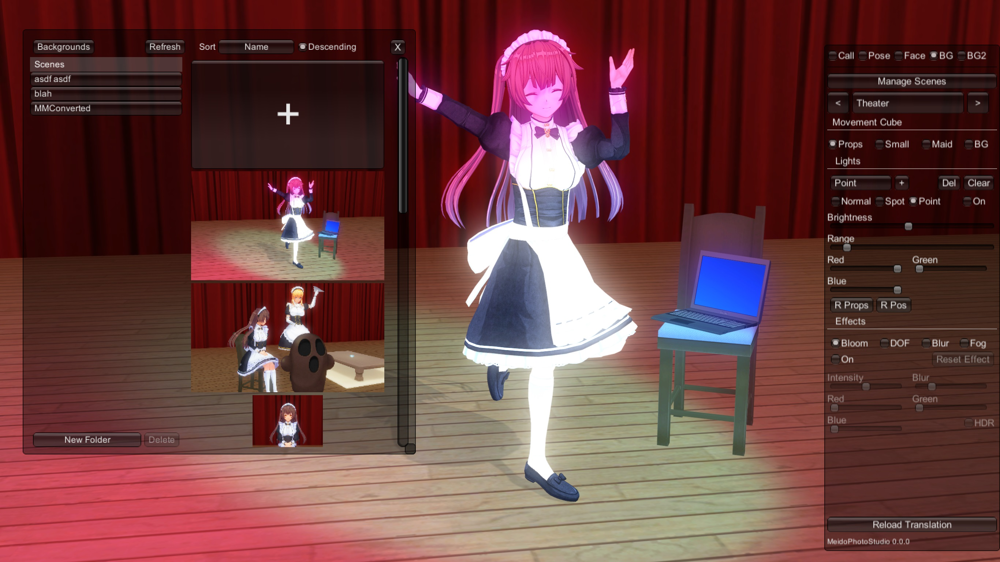
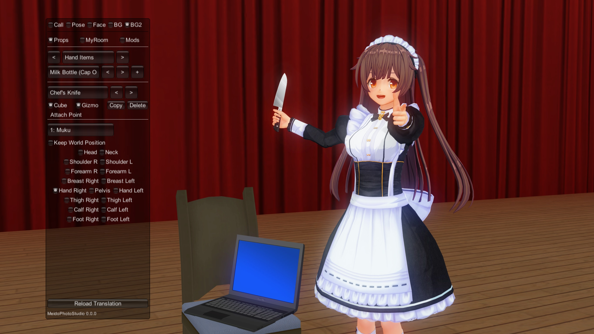
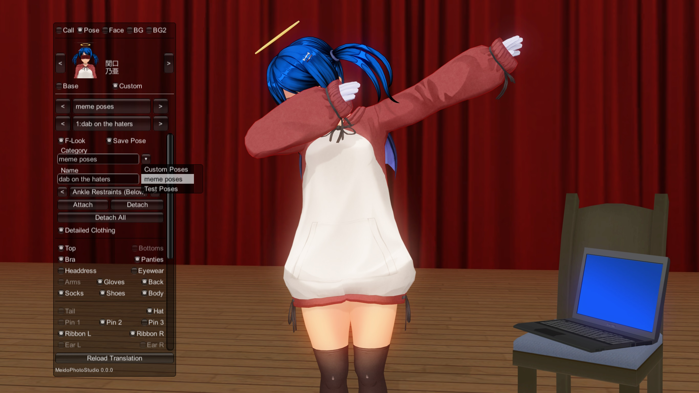
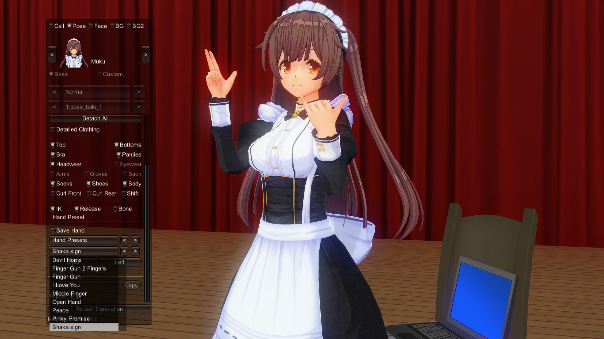
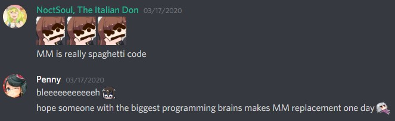

# MeidoPhotoStudio

A screenshot making plugin alternative to Studio Mode.

## Features

* Scene manager akin to the one in my fork of [ModifiedMM](https://git.coder.horse/habeebweeb/modifiedMM)
* Attach ANY prop that MeidoPhotoStudio can spawn
* Pose and hand preset categorization
* Support for studio mode hand preset saving and loading
* Revamped light management
* Many quality of life improvements
* Lightweight (1/5 of the size of MultipleMaids)

## Screenshots

*Scene manager*  


*Attach props*  


*More clothing toggles*  


*Custom pose categories*  


*Custom hand presets and categories*  


## Why Though?



Despite being an overall good plugin (in terms of functionality), MultipleMaids (MM) is plagued with many bugs and is
seldom maintained by the original developer.

A previous project I worked on, ModifiedMM, was an effort to fix some of the problems with MM and even add new features.
Although great progress was made, MM's code base prevents anyone, but the original developer (hopefully),
from making any meaningful changes.

ModifiedMM was also created against the wishes of the original developer as stated in MM's `使い方.txt` (`Usage.txt`).

> "転載・配布・改変したプラグインの公開は禁止します。" (使い方.txt)  

Which translates to _"Publication of reprinted/distributed/modified plug-ins is prohibited"_ (Google Translate).

MeidoPhotoStudio is a completely new plugin, written from the ground up, that aims to deliver a simple and more
streamlined screenshot making experience that is familiar to MultipleMaids users.

## その他 / Note

このプラグインは複数メイド撮影プラグインの改変・改造ではありません。

MeidoPhotoStudio is not based on and does not use any MultipleMaids source code.


## Building

MeidoPhotoStudio requires [.NET 6.0 SDK](https://dot.net) to build.

```
$ git clone 'https://git.coder.horse/habeebweeb/COM3D2.MeidoPhotoStudio.git'
$ cd COM3D2.MeidoPhotoStudio

Copy 'Assembly-UnityScript-firstpass.dll' from your COM3D2 Managed directory (e.g. D:/COM3D2/COM3D2x64_Data/Managed/)
into a directory called ./lib

$ dotnet restore
$ dotnet build -c Release

Binaries are exported to ./src/MeidoPhotoStudio.Plugin/bin/Release/net35
```
